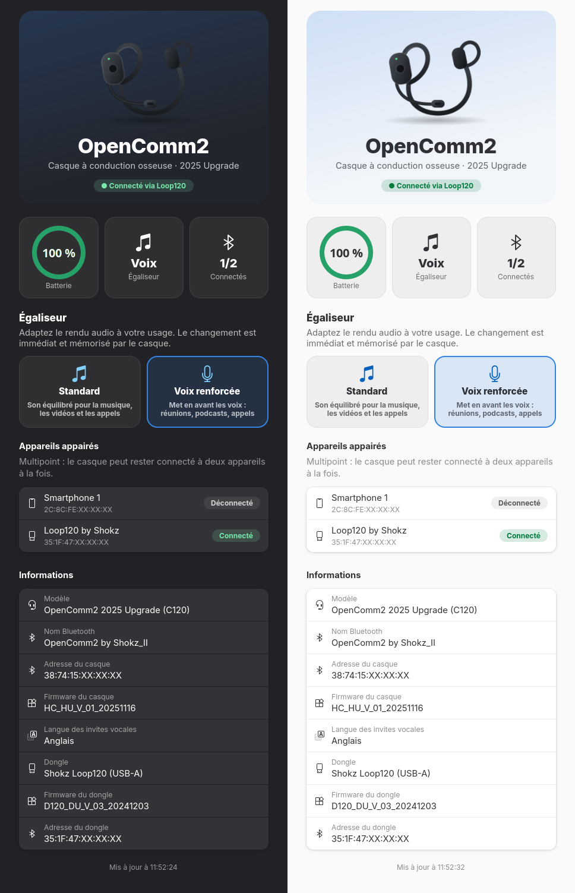

# freeShokz

**Contrôle sous Linux du casque Shokz OpenComm2 via le dongle Loop120**

Une icône dans la barre système, un panneau GTK4/libadwaita et un outil en ligne de commande
pour ce que l'application officielle *Shokz Connect* fait sous Windows et macOS : niveau de
batterie, égaliseur, appareils appairés et informations du casque.



> [!NOTE]
> Projet indépendant, **non affilié à Shokz**. « Shokz », « OpenComm » et « Loop » sont des
> marques de leurs propriétaires. Le protocole a été reconstruit à des fins d'interopérabilité
> (voir [docs/PROTOCOL.md](docs/PROTOCOL.md)) ; aucun code ni aucune ressource Shokz n'est
> redistribué. Utilisation à vos risques.

---

## Sommaire

- [Fonctionnalités](#fonctionnalités)
- [Matériel supporté](#matériel-supporté)
- [Fonctions du casque](#fonctions-du-casque)
- [Prérequis](#prérequis)
- [Installation](#installation)
- [Règle udev (accès au dongle)](#règle-udev-accès-au-dongle)
- [Utilisation](#utilisation)
- [Dépannage](#dépannage)
- [Fonctionnement](#fonctionnement)
- [Structure du dépôt](#structure-du-dépôt)
- [Feuille de route](#feuille-de-route)
- [Contribuer](#contribuer)
- [Licence](#licence)

---

## Fonctionnalités

- **Icône dans la barre** (StatusNotifierItem) dont la jauge suit la batterie du casque : rouge
  sous 20 %, grisée si le casque est éteint, barrée si le dongle est absent.

  

  *De gauche à droite : 100, 80, 60, 40, 20 et 10 %, casque non connecté, dongle absent.*

- **Menu rapide** au clic droit : bascule de l'égaliseur, ouverture du panneau, actualisation,
  sortie.
- **Panneau détaillé** au clic gauche :
  - bandeau produit et jauge de batterie ;
  - choix de l'égaliseur ;
  - appareils appairés, avec leur état de connexion ;
  - firmwares, adresses et langue des invites vocales.
- **Suivi en direct** : notifications du casque, relecture de la batterie toutes les 60 s,
  reconnexion automatique (casque éteint puis rallumé, dongle débranché puis rebranché).
- **Alerte batterie faible** : notification GNOME à 20 % puis à 10 %.
- **Démarrage automatique** à l'ouverture de session, sans fenêtre.
- **CLI `shokzctl`** pour scripter : lecture des paramètres, EQ, écoute des notifications, dump
  hexa des trames.
- Aucune dépendance exotique : Python, GTK4 et libadwaita, déjà présents sur un GNOME récent.
  Le protocole de l'icône (StatusNotifierItem + dbusmenu) est implémenté directement en D-Bus,
  sans libappindicator.

---

## Matériel supporté

| Matériel | Identifiant | État |
|---|---|---|
| **OpenComm2 2025 Upgrade** + dongle **Loop120 USB-A** | USB `3511:2ef2`, casque `C120` | ✅ Testé |
| OpenComm2 2025 Upgrade + dongle **Loop120 USB-C** | USB `3511:2f06` | 🟡 Non testé. Même classe que le USB-A dans l'appli officielle, donc a priori compatible |
| OpenMeet UC + Loop120 | | 🟡 Non testé. Même famille de protocole (`HCVA`), probablement partiel |
| OpenComm2 UC (première génération) + dongle **Loop110** | USB `3511:2b0a` / `2b1e` | ❌ Non supporté (protocole *legacy* différent) |
| Casque connecté directement en Bluetooth, sans dongle | | ❌ Non supporté (le contrôle passe par le dongle) |

Versions testées : casque `HC_HU_V_01_20251116`, dongle `D120_DU_V_03_20241203`.

Vous avez un autre modèle ? Les retours sont les bienvenus, voir [Contribuer](#contribuer).

---

## Fonctions du casque

État sur **OpenComm2 2025 Upgrade** :

| Fonction | Lecture | Écriture | Remarque |
|---|:---:|:---:|---|
| Niveau de batterie | ✅ | – | Par paliers de 10 % |
| Égaliseur (standard / voix renforcée) | ✅ | ✅ | Bascule audible dans le casque |
| Firmware du casque | ✅ | – | |
| Langue des invites vocales | ✅ | ❌ | L'écriture semble téléverser un pack de voix : volontairement non implémentée |
| Multipoint (activé ou non) | ✅ | ❌ | À faire |
| Appareils appairés et état de connexion | ✅ | ❌ | |
| Infos du dongle (firmware, adresse, type de casque) | ✅ | – | |
| État de charge | ❓ | – | Octet présent dans la réponse batterie mais non identifié |
| Mise à jour firmware | – | ❌ | **Volontairement exclue** (risque de rendre le casque inutilisable) |
| Réinitialisation d'usine | – | ❌ | **Volontairement exclue** |

Les autres réglages de *Shokz Connect* (busylight, veille auto, sons des touches, rejet d'appel,
etc.) concernent les OpenComm3 et OpenMeet : l'OpenComm2 ne répond pas à ces commandes. Elles
sont documentées dans [PROTOCOL.md](docs/PROTOCOL.md) et accessibles via `shokzctl raw-get`.

---

## Prérequis

- **Linux**, Python **3.10+**
- **GTK 4** et **libadwaita ≥ 1.6**, avec PyGObject
- Pour l'icône sous **GNOME** : l'extension *AppIndicator and KStatusNotifierItem Support*.
  Elle est installée et active par défaut sur Ubuntu (`ubuntu-appindicators@ubuntu.com`).
- KDE Plasma gère nativement les StatusNotifierItem (non testé)

Dépendances selon la distribution :

```bash
# Debian / Ubuntu
sudo apt install python3-gi python3-gi-cairo gir1.2-gtk-4.0 gir1.2-adw-1

# Fedora
sudo dnf install python3-gobject gtk4 libadwaita

# Arch
sudo pacman -S python-gobject gtk4 libadwaita
```

Le CLI `shokzctl` seul n'a besoin que de Python : aucune dépendance graphique.

---

## Installation

```bash
git clone https://github.com/ttiot/freeShokz.git
cd freeShokz
./install.sh
```

Le script, à lancer en utilisateur normal :

1. vérifie les dépendances et la présence d'une extension AppIndicator ;
2. copie l'application dans `~/.local/share/shokz-tray/` ;
3. crée les commandes `~/.local/bin/shokz-tray` et `~/.local/bin/shokzctl` ;
4. installe les icônes (`~/.local/share/icons/hicolor/`) et l'entrée **« Shokz OpenComm2 »**
   du lanceur ;
5. ajoute le démarrage automatique (`~/.config/autostart/org.shokzctl.Tray.desktop`, lancé avec
   `--background`) ;
6. installe la **règle udev**, si elle manque : c'est la seule étape qui demande `sudo` ;
7. lance l'icône.

Relancer `./install.sh` met à jour une installation existante : l'instance en cours est
arrêtée puis relancée.

### Désinstallation

```bash
./install.sh --uninstall
```

Supprime les fichiers utilisateur, le démarrage automatique et la règle udev.

### Lancer sans installer

Depuis le clone, une fois la règle udev en place :

```bash
python3 shokzctl.py info
python3 shokz_tray.py        # les icônes sont générées au premier lancement
```

---

## Règle udev (accès au dongle)

Par défaut, `/dev/hidraw*` n'est accessible qu'à root. La règle
[`udev/70-shokz-loop120.rules`](udev/70-shokz-loop120.rules) donne accès **à l'utilisateur de la
session active** (ACL via `TAG+="uaccess"`), et **uniquement à l'interface 0** du dongle :

```udev
SUBSYSTEM=="hidraw", ATTRS{idVendor}=="3511", ATTRS{idProduct}=="2ef2", ATTRS{bInterfaceNumber}=="00", TAG+="uaccess", MODE="0660", GROUP="plugdev"
SUBSYSTEM=="hidraw", ATTRS{idVendor}=="3511", ATTRS{idProduct}=="2f06", ATTRS{bInterfaceNumber}=="00", TAG+="uaccess", MODE="0660", GROUP="plugdev"
```

L'interface 1 (usage page `0xFF00`) sert aux mises à jour firmware. Elle reste réservée à root
par choix, pour qu'aucun programme utilisateur ne puisse y écrire par erreur.

`install.sh` s'en charge. Pour l'installer à la main :

```bash
sudo install -m 0644 udev/70-shokz-loop120.rules /etc/udev/rules.d/
sudo udevadm control --reload
sudo udevadm trigger --subsystem-match=hidraw
```

Pour vérifier : `getfacl /dev/hidrawN` (le nœud dont le `HID_NAME` contient « Loop120 ») doit
afficher une ligne `user:<vous>:rw-`. Débrancher puis rebrancher le dongle fonctionne aussi.

---

## Utilisation

### Icône et panneau

- **Clic gauche** : ouvre le panneau. Fermer la fenêtre la masque seulement, l'application
  reste dans la barre.
- **Clic droit** : niveau de batterie exact, égaliseur, « Ouvrir le panneau… », « Actualiser »,
  « Quitter ».
- Relancer « Shokz OpenComm2 » depuis le lanceur ramène le panneau : l'application ne tourne
  qu'en un seul exemplaire.

Options de `shokz-tray` :

| Option / variable | Effet |
|---|---|
| `--background`, `-b` | Démarre sans ouvrir la fenêtre (utilisé par l'autostart) |
| `--debug`, `-d` | Journal détaillé, trames HID comprises |
| `SHOKZ_TRAY_LABEL=1` | Affiche aussi le pourcentage en texte à côté de l'icône |
| `SHOKZ_TRAY_ANONYMIZE=1` | Masque adresses et noms d'appareils (captures d'écran) |
| `SHOKZ_TRAY_SNAPSHOT=/tmp/x.png` | Enregistre un rendu PNG de la fenêtre (débogage) |

### Ligne de commande

```console
$ shokzctl info
dongle             Loop120 (USB-A)
dongle firmware    D120_DU_V_03_20241203
dongle adresse BT  35:1F:47:XX:XX:XX
type casque        C120
casque connecté    oui
casque appairé     OpenComm2 by Shokz_II (38:74:15:XX:XX:XX)
canal SPP          ouvert

$ shokzctl get all
battery            100 %
version            HC_HU_V_01_20251116
language           english
eq                 vocal
multipoint         activé  (brut: 01 01 00)
pairing_list
                    - Smartphone (2C:8C:FE:XX:XX:XX)
                    - Loop120 by Shokz (35:1F:47:XX:XX:XX) [connecté]

$ shokzctl set eq standard
eq                 standard
```

| Commande | Rôle |
|---|---|
| `shokzctl info` | État du dongle et de la liaison avec le casque |
| `shokzctl get <param>` / `get all` | Lit un paramètre du casque (`all` = ceux que gère l'OpenComm2) |
| `shokzctl set eq {standard,vocal}` | Change l'égaliseur |
| `shokzctl listen` | Affiche en direct les notifications du dongle et du casque |
| `shokzctl raw-get 0x17` | `get` brut sur un `tag2` (exploration) |
| `-v` | Affiche les trames envoyées et reçues en hexadécimal |

`shokzctl` peut tourner en même temps que l'icône : chaque programme ignore les réponses qui ne
lui sont pas destinées.

---

## Dépannage

| Symptôme | Cause probable / solution |
|---|---|
| « Dongle non détecté » | `lsusb \| grep 3511` doit lister le Loop120. Essayer un autre port USB. |
| « Accès au dongle refusé » | Règle udev absente : relancer `./install.sh` (voir [Règle udev](#règle-udev-accès-au-dongle)). |
| « Casque non connecté » | Casque éteint ou hors de portée. Il se reconnecte seul au dongle, et freeShokz rouvre le canal automatiquement. |
| L'icône n'apparaît pas | Extension AppIndicator inactive : `gnome-extensions enable ubuntu-appindicators@ubuntu.com` (ou `appindicatorsupport@rgcjonas.gmail.com`). |
| Rien au survol de l'icône | Normal : l'extension GNOME n'affiche pas les infobulles. Le pourcentage figure en tête du menu. |
| Le texte à côté de l'icône s'affiche « … » | Certains thèmes ou extensions de barre tronquent les labels des indicateurs. D'où leur désactivation par défaut (`SHOKZ_TRAY_LABEL=1` pour les remettre). |
| Journal | Quitter l'icône, puis lancer `shokz-tray --debug` dans un terminal. |

---

## Fonctionnement

```
 PC ── USB HID (interface 0) ──► Loop120 ── Bluetooth / SPP ──► OpenComm2
      reports 0x12/0x13 : dongle
      reports 0x14/0x15 : casque (relayés par le dongle)
```

- Chaque commande est une trame `A5 5A` suivie d'un en-tête, d'un CRC-16/MAXIM et d'un TLV
  (`tag1` = cible et méthode, `tag2` = commande).
- Les commandes destinées au casque ne passent qu'après ouverture d'un **canal SPP** entre le
  dongle et le casque (UUID `0xFEF0`). freeShokz l'ouvre automatiquement, comme l'application
  officielle.
- L'application graphique fait tourner un seul thread propriétaire du périphérique. Il publie
  des instantanés d'état vers la boucle GTK, et l'icône est un StatusNotifierItem exposé
  directement en D-Bus.

Le détail complet (trames, CRC, tables de commandes, formats) est dans
**[docs/PROTOCOL.md](docs/PROTOCOL.md)**.

---

## Structure du dépôt

```
freeShokz/
├── shokzctl.py              # protocole + CLI (bibliothèque réutilisée par l'appli)
├── shokz_tray.py            # icône + panneau GTK4/libadwaita
├── install.sh               # installation / mise à jour / désinstallation
├── udev/
│   └── 70-shokz-loop120.rules
├── assets/
│   ├── make_icons.py        # génère les icônes SVG (tray + application)
│   └── headset.svg          # illustration du panneau
└── docs/
    ├── PROTOCOL.md          # description du protocole
    ├── screenshot.png
    └── tray-icons.png
```

---

## Feuille de route

- [ ] Activer ou désactiver le multipoint (`setOpen/CloseDeviceMutConn`)
- [ ] Identifier l'octet d'état de charge dans la réponse batterie
- [ ] Changement de langue des invites, une fois le mécanisme compris
- [ ] Gestion des appareils appairés (connexion, déconnexion, suppression)
- [ ] Tester le Loop120 USB-C et l'OpenMeet
- [ ] Support du Loop110 et de l'OpenComm2 première génération (protocole *legacy*)

---

## Contribuer

Les retours sur d'autres modèles sont précieux. Pour aider :

1. Joindre la sortie de `shokzctl -v info` et de `shokzctl -v get all`.
2. Lancer `shokzctl listen`, puis changer un réglage sur le casque (bouton multifonction,
   charge…), et joindre les notifications affichées.
3. Pour explorer une commande : `shokzctl -v raw-get 0x17`. Les `tag2` possibles sont dans
   [PROTOCOL.md](docs/PROTOCOL.md).

N'écrivez jamais sur l'interface DFU et n'essayez pas les commandes `enterOTAMode` ou
`factoryReset` sur un casque auquel vous tenez.

---

## Licence

[GPL-3.0-or-later](LICENSE). Vous pouvez utiliser, modifier et redistribuer freeShokz, à
condition que les versions redistribuées restent sous la même licence.
